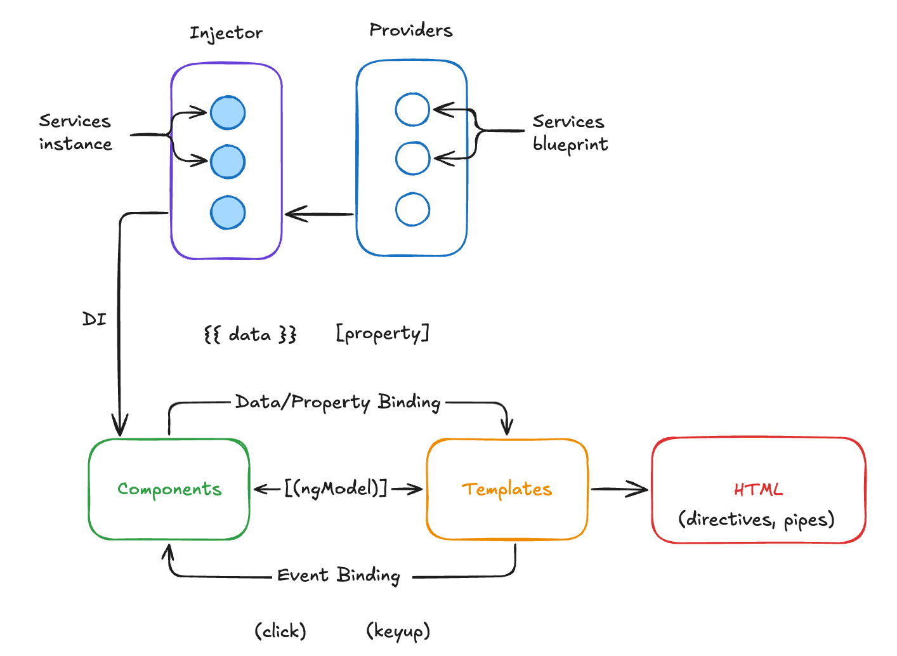

# Clase 4: Pipes, servicios e inyección de dependencias

Esta clase aborda los conceptos fundamentales de Pipes, servicios e inyección de dependencias.

## Estructura del contenido

- **docs/**: Presentación teórica sobre Pipes, servicios e inyección de dependencias
- **project/**: Archivos de la sesión práctica con ejemplos de implementación
- **exercise/**: Reto propuesto para aplicar los conocimientos adquiridos

