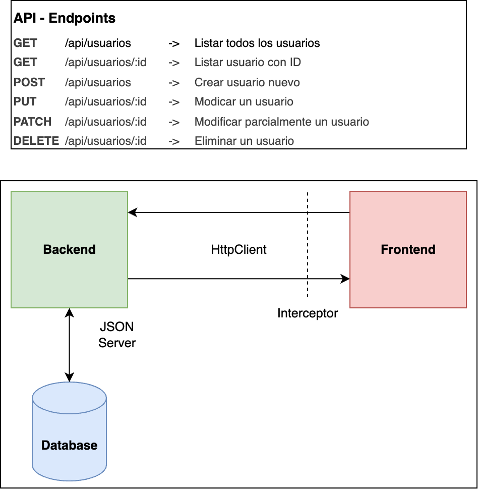

# Clase 7: Comunicación con APIs REST mediante HttpClient

Esta clase aborda los conceptos fundamentales de Comunicación con APIs REST mediante HttpClient.



## Estructura del contenido

- **docs/**: Presentación teórica sobre Comunicación con APIs REST mediante HttpClient
- **project/**: Archivos de la sesión práctica con ejemplos de implementación
  - **team-dashboard/db.json**: Archivo de base de datos de JSON Server
  - **team-dashboard/src/environments/environment.ts**: Archivo de configuración de entorno
  - **team-dashboard/src/app/pages/dashboard/**:
    - **resolver/**: Ejemplo de uso de resolvers para precargar los datos de todos los miembros del equipo
  - **team-dashboard/src/app/pages/team-member-detail/**:
    - **resolver/**: Ejemplo de uso de resolvers para precargar los datos de un miembro del equipo

## Cómo ejecutar el proyecto

### Prerequisitos

- Node.js (versión 18 o superior)
- npm (incluido con Node.js)

### Instalación

1. Navega al directorio del proyecto:

```bash
cd module-3/lesson-7/project/team-dashboard
```

2. Instala las dependencias:

```bash
npm install
```

### Ejecución

#### Desarrollo (Recomendado)

Para ejecutar el servidor de desarrollo de Angular y la API REST simultáneamente:

```bash
npm run dev
```

- La aplicación Angular estará disponible en: `http://localhost:4200`
- El servidor JSON Server (API) estará disponible en: `http://localhost:3000`

#### Solo servidor Angular

Para ejecutar únicamente el servidor de desarrollo de Angular:

```bash
npm start
```

#### Solo API REST

Para ejecutar únicamente el servidor JSON Server:

```bash
npm run api
```

### Otros comandos útiles

- **Build de producción:**

```bash
npm run build
```

Los archivos compilados se generarán en el directorio `dist/`.

- **Ejecutar tests:**

```bash
npm test
```

- **Ejecutar linter:**

```bash
npm run lint
```
