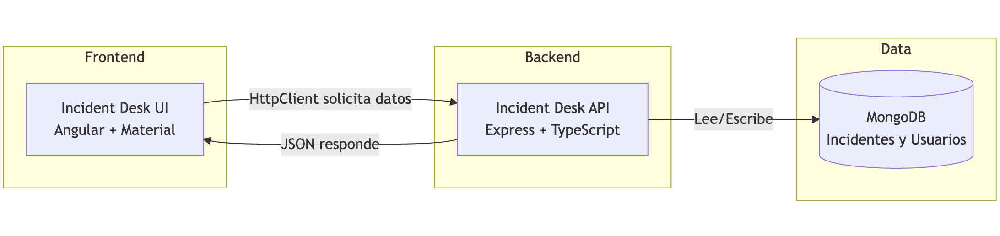

<style scoped>
  h1 strong {
    color: #fbfbfb
  }
  p {
    color: #fff
  }
</style>

# **Clase 1**

Comunicación entre Angular y Node.js mediante APIs REST

---

<!-- backgroundColor: #f6f7f9 -->

<style>
  small {
    font-size: 38px;
  }
</style>

# ¿Qué vamos a aprender hoy?

- Conectar una aplicación Angular con un servidor Node.js/Express
- Crear una API REST simple con Express
- Consumir esa API desde Angular usando HttpClient
- Mostrar los datos mediante tablas con Angular Material

---

<!-- backgroundColor: #f6f7f9 -->

<style scoped>
  img {
    width: 100%;
  }
</style>

# Arquitectura de Nuestra App



**¡Vamos a construir un pequeño sistema de gestión de incidentes!**

---

<!-- backgroundColor: #f6f7f9 -->

# ¿Qué es una API REST?

**REST = Forma estándar de comunicación entre Frontend y Backend**

```typescript
// El Frontend pide datos
GET /api/incidents → Dame todos los incidentes

// El Backend responde
200 OK
[
  { id: 'inc-0001', title: "Sistema caído", severity: "high" },
  { id: 'inc-0002', title: "Error en login", severity: "medium" }
]
```

---

<!-- backgroundColor: #f6f7f9 -->

<h1>
  El Contrato
  <small>(Tipos Compartidos)</small>
</h1>

**Frontend y Backend deben hablar el mismo idioma**

```typescript
export interface Incident {
  id: string
  reference: string // "INC-2024-0001"
  title: string
  severity: 'low' | 'medium' | 'high' | 'critical'
  status: 'new' | 'ack' | 'in_progress' | 'resolved'
  reportedBy: string
  assignedTo?: string
}
```
