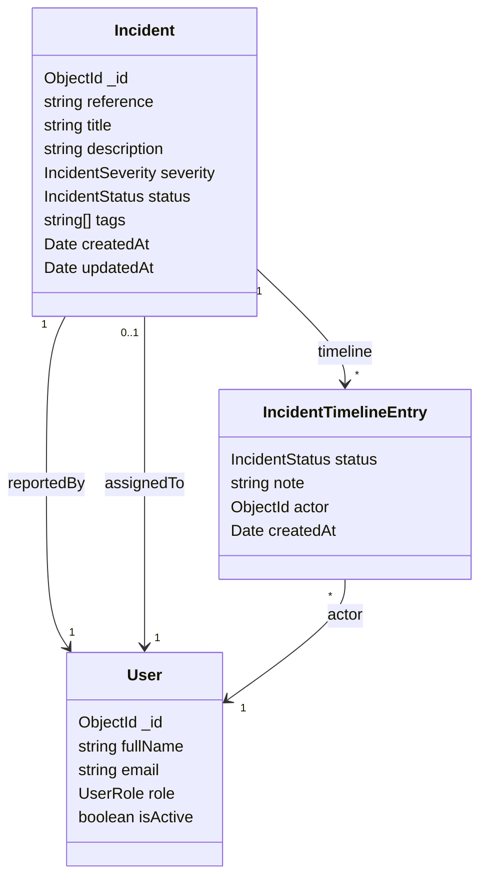

<style scoped>
  h1 strong {
    color: #fbfbfb
  }
  p {
    color: #fff
  }
</style>

# **Clase 2**

Profundizamos en la arquitectura fullstack, contrato de datos y formularios reactivos.

---

<!-- backgroundColor: #f6f7f9 -->

<style>
  small {
    font-size: 38px;
  }
</style>

# ¿Qué vamos a aprender hoy?

- Mapear la arquitectura Angular ↔ Express ↔ MongoDB.
- Modelar colecciones, documentos y esquemas con Mongoose.
- Alinear el contrato `Incident` entre API y UI.
- Migrar formularios clave a un enfoque reactivo con signals.

---

<!-- backgroundColor: #f6f7f9 -->

<style scoped>
  img {
    width: 100%;
  }
</style>

# Arquitectura de la aplicación


**Angular** consume la API REST de **Express**, que persiste incidentes en **MongoDB**.

---

<!-- backgroundColor: #f6f7f9 -->

# Colecciones, documentos y esquemas

- **Collection**: agrupación de documentos que comparten la misma intención (`incidents`, `users`). Piensa en ellas como tablas flexibles.
- **Document**: instancia individual almacenada como BSON (Binary JSON). MongoDB lo serializa/consume como JSON, pero internamente maneja tipos extra (`ObjectId`, `Date`, `Decimal128`).
- **Schema** (Mongoose): describe la forma del documento, validaciones y defaults. Nos asegura que lo que guardamos desde Angular coincide con lo que espera la base.
- Buenas prácticas: usar enums para estados y severidades, timestamps automáticos y referencias (`ObjectId`) hacia usuarios.

---

<!-- backgroundColor: #f6f7f9 -->

# Modelo de entidades

- `User`: gestor o analista; contiene `fullName`, `email`, `role`, `isActive`.
- `Incident`: referencia legible, severidad, estado y responsables (`reportedBy`, `assignedTo`).
- `IncidentTimelineEntry`: cambios de estado con `note`, `actor`, `createdAt`.
- Relaciones: un incidente acumula timeline entries y se relaciona con usuarios por `ObjectId`.



---

<!-- backgroundColor: #f6f7f9 -->

# Contrato API ↔ UI

**Frontend y Backend deben compartir la misma forma de datos.**

```typescript
export interface Incident {
  id: string;
  reference: string;
  title: string;
  severity: 'low' | 'medium' | 'high' | 'critical';
  status: 'new' | 'ack' | 'in_progress' | 'resolved';
  reportedBy: string;
  assignedTo?: string;
}
```

```typescript
export interface IncidentTimelineEntry {
  status: Incident['status'];
  note: string;
  actor: string;
  createdAt: string;
}
```

---

<!-- backgroundColor: #f6f7f9 -->

# Formularios reactivos vs template-driven

- Template-driven: `[(ngModel)]` rápido para prototipos, pero poco testeable y sin tipos.
- Reactive forms: `FormGroup`, `FormControl`, validaciones declarativas y mayor trazabilidad.
- Estrategia: mapear campos al contrato API, definir validaciones sincronizadas y mensajes reutilizables.
- Resultado: formularios alineados con el backend y fáciles de mantener.

---

<!-- backgroundColor: #f6f7f9 -->

# Signals en Angular para formularios

- Una señal (`signal`) es un contenedor reactivo: se lee como función (`loading()`) y se actualiza con `set`/`update`. Angular detecta los cambios sin `ChangeDetectorRef` ni suscripciones manuales.
- Son ideales para estado UI como loaders, entidades seleccionadas o catálogos: cada cambio invalida la vista asociada automáticamente.
- Ejemplo:
  ```typescript
  const filters = signal({ severity: 'all', status: 'open' })
  effect(() => incidentService.getList(filters()))
  ```
- En IncidentDetail usamos señales para `loading`, `incident`, `reporters` y `agents`, lo que simplifica la sincronización con el formulario reactivo.
