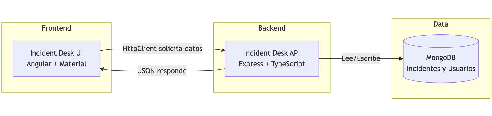
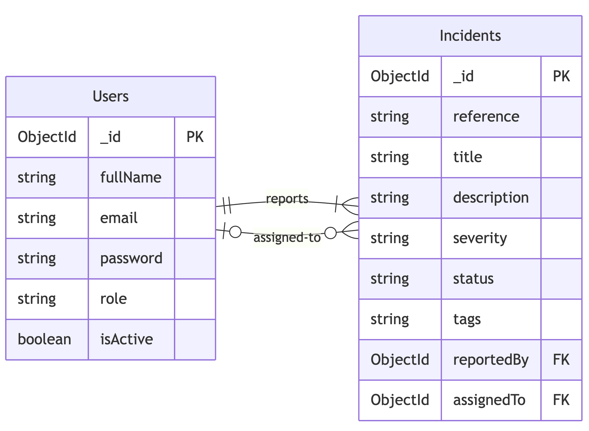

<style scoped>
  h1 strong {
    color: #fbfbfb
  }
  p {
    color: #fff
  }
</style>

# **Clase 2**

CRUD completo en aplicaciones MEAN

---

<!-- backgroundColor: #f6f7f9 -->

<style>
  small {
    font-size: 38px;
  }
</style>

# ¿Qué vamos a aprender hoy?

- Mapear la arquitectura Angular ↔ Express ↔ MongoDB.
- Modelar colecciones, documentos y esquemas con Mongoose.
- Alinear el contrato `Incident` y `User` entre API y UI.
- Repaso de Formularios Reactivos.
- Angular v16 (experimental) y v17 (estable) -> Signals `signal`.

---

<!-- backgroundColor: #f6f7f9 -->

<style scoped>
  img {
    width: 100%;
  }
</style>

# Arquitectura de la aplicación



**Angular** consume la API REST de **Express**, que persiste incidentes en **MongoDB**.

---

<!-- backgroundColor: #f6f7f9 -->

# Colecciones, documentos y esquemas

- **Collection**: agrupación de documentos que comparten la misma intención (`incidents`, `users`). Piensa en ellas como tablas flexibles.
- **Document**: instancia individual almacenada como BSON (Binary JSON). MongoDB lo serializa/consume como JSON, pero internamente maneja tipos extra (`ObjectId`, `Date`, `Decimal128`).
- **Schema** (Mongoose): describe la forma del documento, validaciones y defaults. Nos asegura que lo que guardamos desde Angular coincide con lo que espera la base.

---

<!-- backgroundColor: #f6f7f9 -->

# Entidades

- `User`: quién reporta o resuelve el incidente.
- `Incident`: incidentes reportados, por resolver y resueltos.
- Relaciones:
  - Un usuario `reporter` puede reportar muchos incidentes, y cada incidente tiene exactamente un **reporter** `reportedBy`.
  - Un usuario `agent` puede ser asignado a cero o más incidentes; y cada incidente puede o no tener un **agent** `assignedTo`.

---

<!-- backgroundColor: #f6f7f9 -->

<style scoped>
  p {
    text-align: center
  }
  img {
    width: 60%;
  }
</style>

# Modelo de entidades



---

<!-- backgroundColor: #f6f7f9 -->

# Signals en Angular

**Piensa en una signal como una caja mágica:**
- 📦 Guardas algo dentro: `loading = signal(false)`
- 👀 Para ver qué hay dentro, la abres: `loading()`
- ✏️ Para cambiar lo que hay dentro: `loading.set(true)`
- 🪄 La magia: cuando cambias el contenido, Angular **automáticamente** actualiza todo lo que usa esa caja en la pantalla

---

<!-- backgroundColor: #f6f7f9 -->

# Cómo se usa

```typescript
// Crear la caja con un valor
loading = signal(false);

// Ver qué hay en la caja
if (loading()) {
  console.log('Estamos cargando...');
}

// Cambiar el contenido de la caja
loading.set(true);  // Ahora la pantalla se actualiza sola
```

**En el template:** `<div *ngIf="loading()">Cargando...</div>`

---

<!-- backgroundColor: #f6f7f9 -->

# ¿Cuándo usar Signals?

- ✅ Estado de carga: `loading`, `saving`, `processing`
- ✅ Datos del usuario: `currentUser`, `isLoggedIn`
- ✅ Listas: `incidents`, `users`, `agents`
- ✅ Formularios: datos que se muestran en selects, inputs

---

<!-- backgroundColor: #f6f7f9 -->

# Beneficios

- 🚀 **Más simple**: no necesitas `subscribe()` ni `unsubscribe()`
- ⚡ **Más rápido**: Angular solo actualiza lo necesario
- 🎯 **Más claro**: lees el código y entiendes qué cambia
