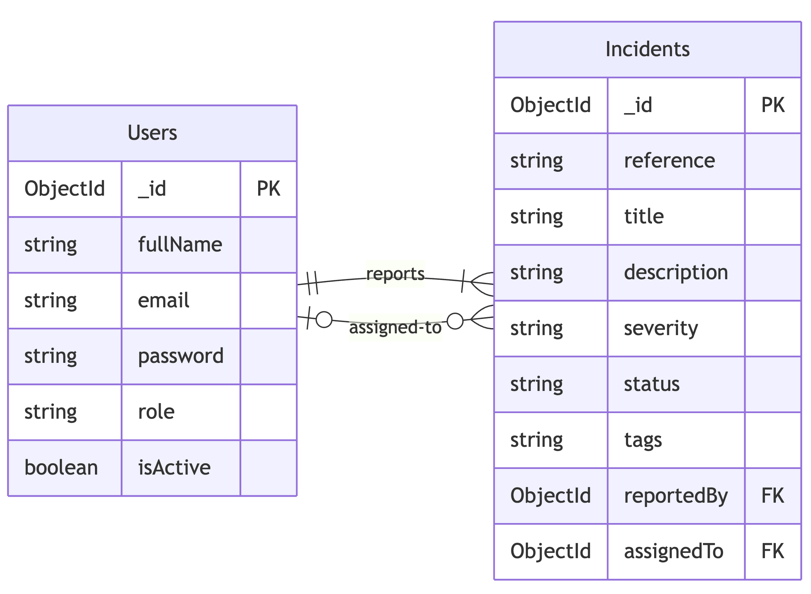
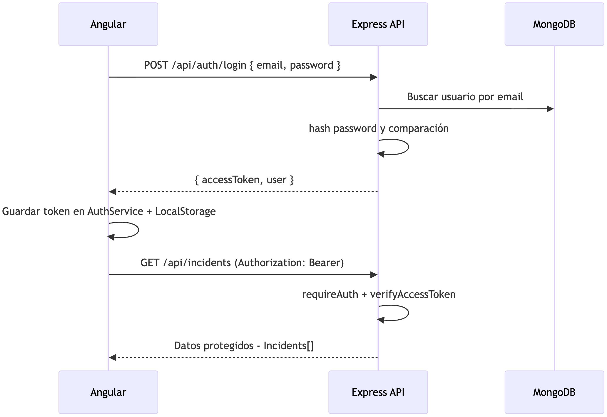
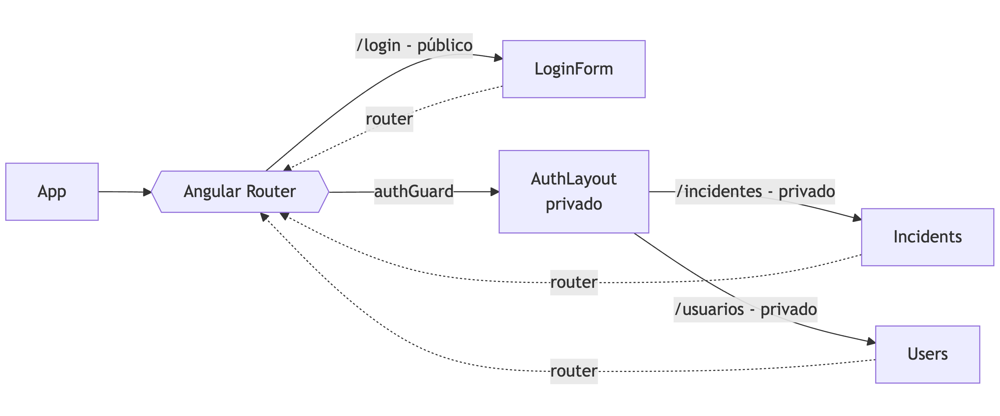

<style scoped>
  h1 strong {
    color: #fbfbfb;
  }
  p, li {
    color: #fff;
  }
</style>

# **Clase 3**

Gestión de autenticación con JWT y Angular

---

<!-- backgroundColor: #f6f7f9 -->

# ¿Qué haremos hoy?

- Entender qué es un token JWT.
- Proteger la API para que sólo procese peticiones autorizadas.
- Guardar la sesión en Angular con un `AuthService`.
- Dejar que un interceptor agregue el token por nosotros.
- Construir un `LoginForm` standalone.
- Controlar la navegación con `AuthLayout` + guards.

---

<!-- backgroundColor: #f6f7f9 -->

<style scoped>
  img {
    width: 100%;
  }
</style>

# Arquitectura de la aplicación


---

<!-- backgroundColor: #f6f7f9 -->

<style scoped>
  p {
    text-align: center
  }
  img {
    width: 60%;
  }
</style>

# Modelo de entidades



---

<!-- backgroundColor: #f6f7f9 -->

# Token en pocas palabras (JWT)

- 🎟️ **JWT** = un JSON firmado que dice quién eres.
- 🖊️ La API lo firma con un secreto (`JWT_ACCESS_SECRET`).
- ⏱️ Tiene fecha de caducidad (`15m` por defecto).
- ❌ Si el token es falso o vencido → la petición se rechaza.

```
Header(xxxxx).Payload(yyyyy).Signature(zzzzz)
xxxxx.yyyyy.zzzzz
```

---

<!-- backgroundColor: #f6f7f9 -->

<style scoped>
  ul {
    font-size: 90%
  }
</style>

# Partes de un JWT

- **Header (xxxxx)**
  - Algoritmo (`alg`, ejemplo: HS256)
  - Tipo (`typ`, siempre `JWT`)
- **Payload (yyyyy)**
  - Datos firmados: `sub`, `email`, `role`, `exp`, etc.
  - No debe incluir información sensible (passwords)
- **Signature (zzzzz)**
  - `HMACSHA256(base64(header) + "." + base64(payload), JWT_ACCESS_SECRET)`
  - Cambia si alguien modifica el header o payload

---

<!-- backgroundColor: #f6f7f9 -->

# Viaje del token

1. 👩‍💻 Front envía email + password a `/api/auth/login`.
2. 🧠 API busca el usuario y compara el password con `bcrypt`.
3. ✍️ API crea el token (`accessToken`) y lo devuelve con el usuario.
4. 💾 Front guarda `{ accessToken, user }` en `AuthService` + `localStorage`.

---

<!-- backgroundColor: #f6f7f9 -->

<style scoped>
  p {
    text-align: center
  }
  img {
    width: 67%;
  }
</style>

# Flujo completo



---

<!-- backgroundColor: #f6f7f9 -->

<style scoped>
  p {
    text-align: center
  }
  img {
    width: 100%;
  }
</style>

# Flujo Angular


