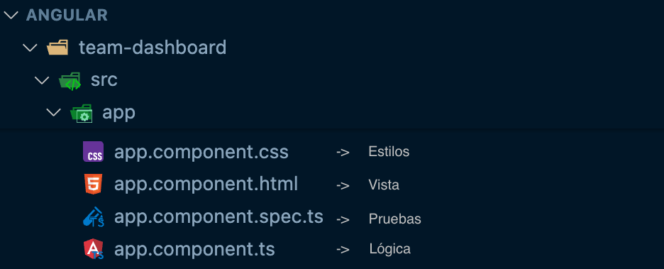
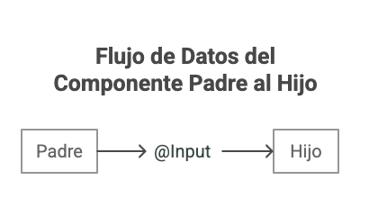

<style scoped>
  h1 strong {
    color: #fbfbfb
  }
  p {
    color: #fff
  }
</style>


# **Clase 2**

Componentes y plantillas en Angular

---

<!-- backgroundColor: #f6f7f9 -->

# Objetivos

- Entender la estructura y anatomía de los componentes en Angular (clase, plantilla, selector, estilos)
- Aplicar interpolación de texto y property binding
- Construir componentes y entender el sistema de imports

---

<style scoped>
  p {
    text-align: center
  }
  img {
    width: 80%
  }
</style>

# Aplicación


---

# ¿Qué es un Componente?

- Un **componente** en Angular es un **bloque de código reutilizable** que combina lógica, datos y presentación.
- Técnicamente, es una clase TypeScript decorada con `@Component` que encapsula datos (propiedades), comportamiento (métodos) y vista (plantilla)

---

<style scoped>
  p {
    text-align: center
  }
</style>

# Estructura de un Componente



---

# Anatomía de un Componente

```typescript
import { Component } from '@angular/core'

@Component({
  selector: 'profile-photo', // Selector CSS
  template: ``, // Template HTML
  styles: `img { border-radius: 50%; }`, // Estilos CSS (opcional pero recomendado)
})
export class ProfilePhoto {
  // Clase TypeScript con comportamientos
}
```

---

# ¿Qué es una Plantilla?

Una **plantilla** es un archivo HTML que define cómo se debe renderizar la vista de un componente. Las plantillas combinan HTML estándar con sintaxis especial de Angular como:

- Interpolación `{{ }}`
- Property Binding `[ ]`
- Event Binding `( )`
- Directivas Estructurales `*ngFor`, `*ngIf`

---

# Plantilla inline

```typescript
@Component({
  selector: 'greeting-card',
  template: `
    <div class="card">
      <h2>{{ title }}</h2>
      <p>{{ message }}</p>
    </div>
  `,
  styles: `.card { padding: 20px; }`
})
```

---

# Archivos separados

```typescript
@Component({
  selector: 'greeting-card',
  templateUrl: './greeting-card.component.html',
  styleUrl: './greeting-card.component.css'
})
```

---

<style scoped>
  p {
    text-align: center
  }
  img {
    width: 50%
  }
</style>

# @Input



---

<style scoped>
  p {
    text-align: center
  }
  img {
    width: 50%
  }
</style>

# @Output


