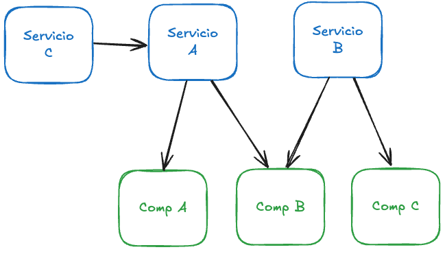

<style scoped>
  h1 strong {
    color: #fbfbfb
  }
  p {
    color: #fff
  }
</style>


# **Clase 4**

Pipes, servicios e inyección de dependencias

---

<!-- backgroundColor: #f6f7f9 -->

<style>
  small {
    font-size: 38px;
  }
</style>

<style scoped>
  p {
    text-align: center
  }
  img {
    width: 70%
  }
</style>

<h1>
  Pipes
  <small>(Transformación de datos)</small>
</h1>

- Transforman datos en las plantillas sin modificar el valor original.
- Se utilizan con el operador `|` (pipe).
- Angular incluye pipes integrados y permite crear pipes personalizados.


---

# Pipes Integrados

Angular proporciona pipes comunes para casos de uso frecuentes:

- **`date`**: Formatea fechas
- **`uppercase/lowercase`**: Cambia el caso del texto
- **`titlecase`**: Capitaliza cada palabra
- **`currency`**: Formatea valores monetarios
- **`json`**: Convierte objetos a formato JSON

---

# date pipe

```typescript
export class TeamMemberCardComponent {
  member = {
    name: 'carlos rodríguez',
    joinDate: new Date('2017-03-15')
  }
}
```

```html
<div class="info-row">
  <span class="label">Fecha de ingreso:</span>
  <span class="value">{{ member.joinDate | date:'MMMM yyyy':'':'es' }}</span>
</div>
```

**Resultado:** `Marzo 2017`

---

# titlecase pipe

```typescript
export class TeamMemberCardComponent {
  member = {
    name: 'carlos rodríguez',
    role: 'Tech Lead'
  }
}
```

```html
<div class="basic-info">
  <h3>{{ member.name | titlecase }}</h3>
  <p class="role">{{ member.role }}</p>
</div>
```

**Resultado:** `Carlos Rodríguez`

---

<h1>
  Pipes Personalizados
  <small>(Custom Pipes)</small>
</h1>

- Implementan la interfaz `PipeTransform`.
- Se decoran con `@Pipe({ name: 'pipeName' })`.
- Método requerido: `transform(value: any, ...args: any[]): any`.
- Pueden recibir parámetros adicionales.

---

# Servicios

- Clases que encapsulan lógica de negocio, datos y funcionalidades.
- Promueven la reutilización de código y separación de responsabilidades.
- Se decoran con `@Injectable()`.
- Son ideales para operaciones como llamadas HTTP, validaciones y gestión de estado.

---


# ¿Cuándo crear un Servicio?

- **Datos compartidos** entre múltiples componentes
- **Lógica de negocio** compleja que no pertenece a un componente
- **Operaciones HTTP** (API calls)
- **Validaciones** y transformaciones de datos
- **Logging** y monitoreo
- **Utilidades** reutilizables

---

<style scoped>
  p {
    text-align: center
  }
  img {
    width: 70%
  }
</style>



---

# Creando un Servicio

```typescript
import { Injectable } from '@angular/core';
import { TeamMember } from '../models/team-member.interface';
import { TEAM_MEMBERS_DATA } from '../data/team-members.data';

@Injectable({
  providedIn: 'root'
})
export class TeamMemberService {
  private teamMembers: TeamMember[] = TEAM_MEMBERS_DATA;
}
```

---

# Inyección de Dependencias

- Patrón de diseño que permite que las clases reciban sus dependencias desde el exterior.
- Angular proporciona un sistema de DI robusto y automático.
- Facilita testing, mantenimiento y escalabilidad.
- Se configura a través del constructor del componente o servicio.

---

# ¿Por qué usar DI?

1. **Desacoplamiento**: Las clases no crean sus dependencias directamente
2. **Testabilidad**: Fácil reemplazar dependencias con mocks
3. **Reutilización**: Un servicio puede ser usado en múltiples lugares
4. **Mantenimiento**: Cambios en un servicio se propagan automáticamente

---

# Inyectando un Servicio

```typescript
import { Component, OnInit } from '@angular/core';
import { TeamMemberService } from './services/team-member.service';

@Component({
  selector: 'app-root',
  // ...
})
export class AppComponent implements OnInit {
  teamMembers: TeamMember[] = [];

  constructor(private teamMemberService: TeamMemberService) {}
}
```

---

# Múltiples Servicios

```typescript
export class AppComponent implements OnInit {
  constructor(
    private teamMemberService: TeamMemberService,
    private favoriteService: FavoriteService,
  ) {}
}
```

---

# Service que usa otro Service

```typescript
@Injectable({
  providedIn: 'root'
})
export class FavoriteService {
  private favorites: number[] = [];

  constructor(private logger: LoggerService) {}

}
```

---

# providedIn: 'root'

```typescript
@Injectable({
  providedIn: 'root' // El servicio estará disponible globalmente
})
export class LoggerService {
}
```

- **Singleton**: Una sola instancia en toda la aplicación
- **Disponible globalmente**: Puede inyectarse en cualquier lugar
