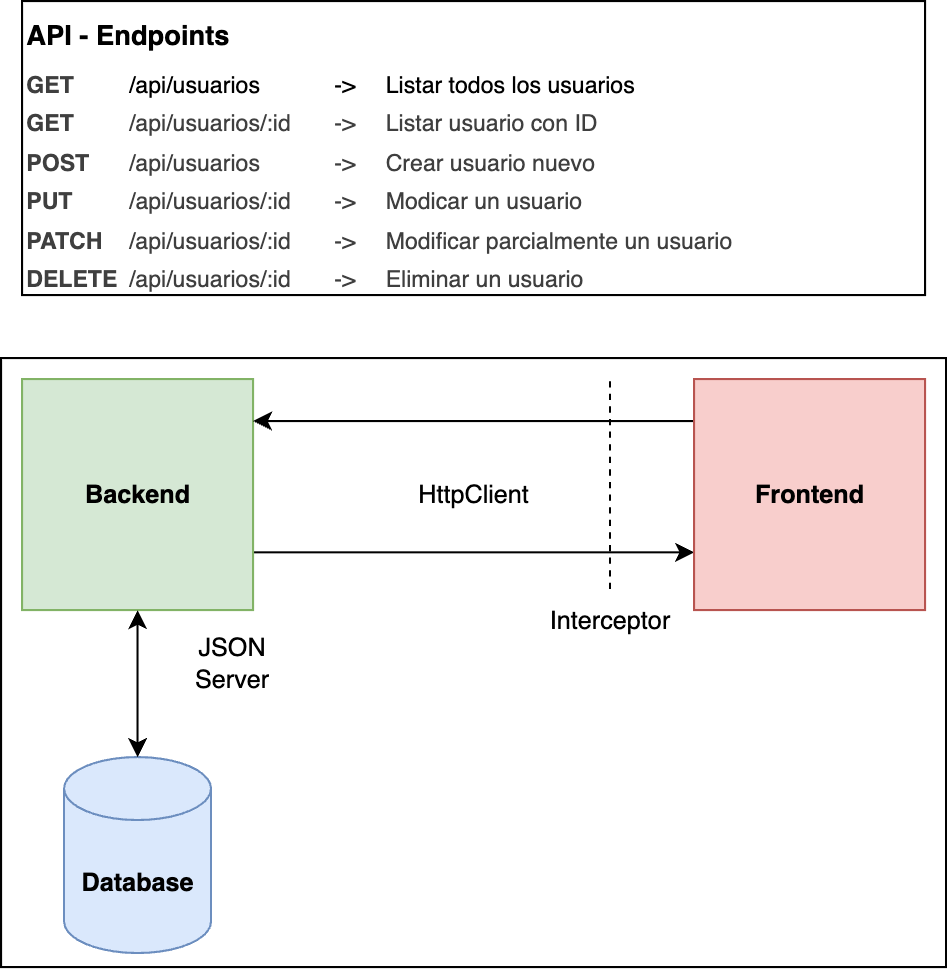

# Clase 7: Comunicación con APIs REST mediante HttpClient

Esta clase aborda los conceptos fundamentales de Comunicación con APIs REST mediante HttpClient.

## Estructura del contenido

- **docs/**: Presentación teórica sobre Comunicación con APIs REST mediante HttpClient
- **project/**: Archivos de la sesión práctica con ejemplos de implementación
  - **team-dashboard/db.json**: Archivo de base de datos de JSON Server
  - **team-dashboard/src/environments/environment.ts**: Archivo de configuración de entorno
  - **team-dashboard/src/app/pages/dashboard/**:
    - **resolver/**: Ejemplo de uso de resolvers para precargar los datos de todos los miembros del equipo
  - **team-dashboard/src/app/pages/team-member-detail/**:
    - **resolver/**: Ejemplo de uso de resolvers para precargar los datos de un miembro del equipo

